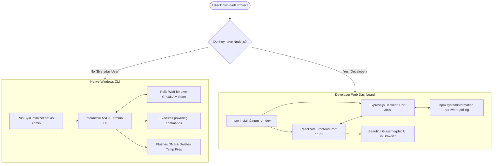

# SysOptimizer 🚀

A pristine, high-performance application designed to manage your Windows system performance with a single click. 

**SysOptimizer** is built with a dual-architecture approach to serve both everyday users (who need a zero-installation executable) and developers (who want a beautiful React web dashboard).

---

## 🏗️ Architecture & Flowchart

The project is split into two distinct paths depending on the user's technical expertise and requirements:

---

## 1. The Native Windows CLI (For Everyday Users)

If you just want to speed up your laptop and do not want to install any software or dependencies, use the native CLI script.

### Features
* **Zero Installations:** Built entirely in native Windows Batch/PowerShell. No Node.js required.
* **Live Polling:** Displays real-time CPU Load % and Free RAM directly in the Command Prompt.
* **Instant Tweaks:** Choose a numbered option to instantly rewrite Windows power configurations or delete temporary system junk.

### How to use it:
1. Download this repository as a `.zip` to your computer and extract it.
2. Locate the file named `SysOptimizer.bat`.
3. Right-click the file and select **"Run as Administrator"**.
4. The terminal window will open with the ASCII menu. Type a number and press Enter!

---

## 2. The React Web Dashboard (For Developers)

If you are a web developer who wants to tinker with a slick, dark-mode, system-level dashboard interface, boot up the development framework.

### Features
* **Interactive Dashboard:** Wrote a sleek, dark-mode CSS dashboard with distinct "Cards" for the performance modes.
* **Real-Time Hardware Monitor:** The UI polls the local proxy server every 2.5 seconds to display live CPU Load, CPU Temperature, RAM Usage, and Battery Status.
* **Visual Alerts:** The dashboard dynamically turns red or yellow to warn you of thermal throttling or memory hogs.

### How to boot it:
1. Ensure you have Node.js installed on your machine.
2. Clone this repository or open it in your terminal.
3. Run `npm install` to download the Express, React, and SystemInformation dependencies.
4. Run `npm run dev` to boot both the frontend and backend servers concurrently.
5. Open your web browser to `http://localhost:5173`.

---

## ⚠️ Disclaimer & Safety Warning

**Please read before using:**
This application interacts directly with your Windows Operating System's low-level power configurations and file system. 

* **Beast Mode:** Unlocks the "Ultimate Performance" power plan which bypasses standard thermal and power throttling. **Use with caution on laptops**, as it will generate significantly more heat and drain the battery faster. Ensure your device has adequate cooling.
* **Junk Cleaner:** Permanently deletes files from your `%TEMP%` and `C:\Windows\Temp` directories. While these are safe to delete in 99% of cases, do not run this tool while installing major software or system updates.

> By using SysOptimizer, you understand that modifying system power states and deleting system files carries inherent risks. The creators of this tool are not responsible for any hardware degradation, data loss, or system instability. Use responsibly!
